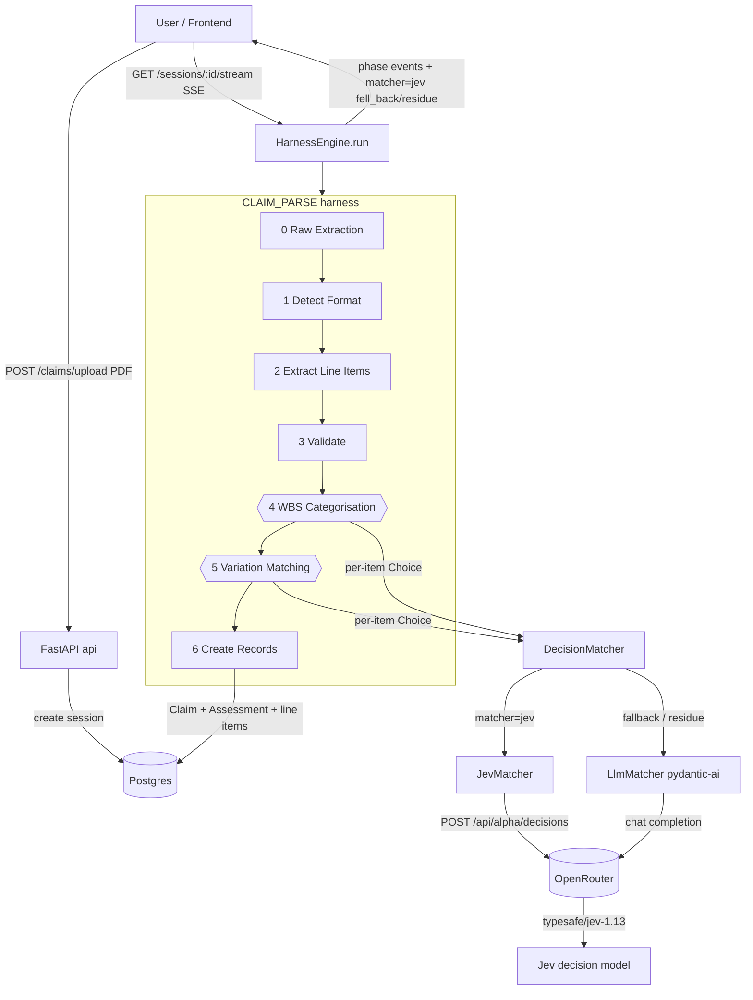
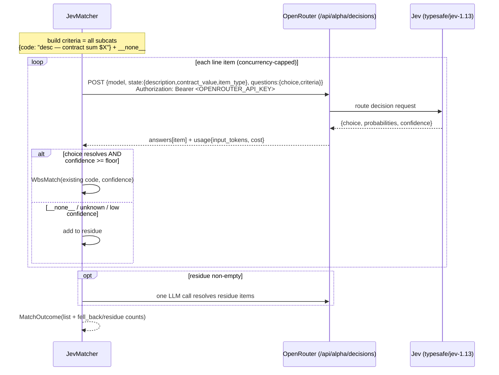

# Procure AI + Jev Matching — How It Works

> **Setting up?** See **[GETTING_STARTED.md](./GETTING_STARTED.md)** to install and run the stack. This document explains how it works.

**What it does:** turns a contractor's payment-claim PDF into validated domain records (Claim + Assessment + line items), categorising each line against the project's Work Breakdown Structure (WBS). The two categorisation phases run on **Jev**, a TypeSafe "System One" decision model, reached through **OpenRouter**, with a normal LLM as a logged fallback.

---

## Tech stack

- **Backend** — Python 3.12, FastAPI, SQLAlchemy (async), Postgres. Served by `uvicorn`.
- **Pipeline** — an in-house "harness" engine (`app/harness/`) that runs a claim through ordered phases.
- **LLM layer** — pydantic-ai (`agent_runner.py`) for typed/validated structured output; provider = DeepSeek / OpenAI / Anthropic / OpenRouter via one OpenAI-compatible seam.
- **Decision model** — Jev (`typesafe/jev-1.13`) via OpenRouter's decisions API; `httpx` client.
- **Runtime** — Docker Compose (`db`, `api`, `frontend`); `just start` builds + migrates + seeds + runs.

---

## The pipeline — one claim, seven phases

`HarnessEngine.run()` streams phases over Server-Sent Events; each writes a workspace JSON the next consumes.

- **0 · Raw Extraction** (programmatic) → text + tables from the PDF → `raw_extraction.json`
- **1 · Detect Format** (programmatic) → WBPRO vs generic → `format_detection.json`
- **2 · Extract Line Items** (programmatic*; LLM only for non-WBPRO) → `parsed_claim.json`
- **3 · Validate Claim** (programmatic) → contractor-math checks → `validation_summary.json`
- **4 · WBS Categorisation** (**Jev**) → each contract-work line → a WBS subcategory → `wbs_matches.json`
- **5 · Variation Matching** (**Jev**) → each variation / provisional-sum line → an existing record (or new) → `vps_matches.json`
- **6 · Create Records** (programmatic) → writes Claim + Assessment + line items (with `suggested_wbs_code_id` + stored confidence) → DB

\* WBPRO claims (Gilmours) parse deterministically; other formats use one pydantic-ai call.

---

## The matcher — strategy seam (phases 4 & 5)

- Phases 4 & 5 are type `LLM_BATCH_AGENTS`, dispatched by `engine._run_decision_match`.
- Matcher chosen by `phase_def.matcher → settings.matcher_default → "llm"`.
  - **`JevMatcher`** (default) — one Jev **Choice** per line item, fanned out concurrently.
  - **`LlmMatcher`** (fallback) — the existing single pydantic-ai call; also handles the residue.
- Both return a `MatchOutcome` (typed list + JSON + usage + `fell_back`/`residue` counts); the workspace-file contract is unchanged, so `create_records` is untouched.

### How Jev decides one line item

- **State** (sent to Jev) = the line item: `description`, `contract_value`, `item_type`.
- **Criteria** = every WBS subcategory as `{code: "<description> — contract sum $<amount>"}` + a `__none__` option.
- **Signal that matters:** description **and** the line's cost vs each subcategory's `contract_sum`.
  - description-only → ambiguous, collapses on similar wording.
  - sum-only → fails on ties (two codes with the same budget).
  - **description + cost ⇒ sum is a near-unique key, description breaks ties** — the winning combination.
- Jev returns `choice`, a full `probabilities` distribution, and a calibrated `confidence`.
  - `choice` resolves to an existing code → direct match.
  - `__none__` / unknown / `confidence < floor` → **residue** → one LLM call resolves those items only.

### Fallback to the LLM

When Jev can't commit — it picks `__none__`, its choice doesn't resolve, `confidence < jev_confidence_floor`, or the call errors after retries — those items are passed to the `LlmMatcher` in a single call while the confident Jev matches are kept. If Jev is unconfigured entirely, the whole phase runs on the LLM (logged); only config/credit errors (401/403/400/402/404/422) raise instead of falling back.

### No silent failures (hard rule)

- `401/403` (auth) and `400/402/404/422` (config/credit) → **raise loudly**, never a quiet fallback.
- `429/529` → bounded retry with backoff; then per-item fallback to the LLM, **logged**.
- Malformed answer / network error (per item) → logged + fallback; a total outage logs a summary.
- Every run reports `matcher=jev fell_back=a/N residue=b/N` in the phase detail, so degradation is visible.

---

## Diagram — end-to-end run

## Diagram — one Jev decision via OpenRouter

---

## Config (the knobs)

| Setting | Default | Meaning |
|---|---|---|
| `matcher_default` | `llm` | global matcher when a phase doesn't set one (phases 4/5 set `jev`) |
| `jev_model` | `typesafe/jev-1.13` | pinned Jev version (avoid the `~latest` alias in prod) |
| `jev_decisions_url` | `https://openrouter.ai/api/alpha/decisions` | OpenRouter decisions endpoint |
| `jev_max_concurrency` | `8` | in-flight Jev calls per phase |
| `jev_confidence_floor` | `0.6` | below this → route the item to the LLM residue |
| `open_router_api_key` | — | **reused for Jev** (no separate key) |

**Data dependency:** Jev's sum signal only works when the project's WBS subcategories carry `contract_sum`. With them populated (matching the contract/payment-recommendation breakdown), Jev matches the large majority of lines directly; without them it falls back to the LLM.

---

## Swappable later (same seam)

The `DecisionMatcher` interface matches the shared decision-model contract (state + typed question → choice + probabilities + confidence), so these drop in as new adapters without touching the engine: **Cloudflare Clef** (open-source, Workers AI), **Fastino TLMs**, or the native **TypeSafe SDK** transport.
